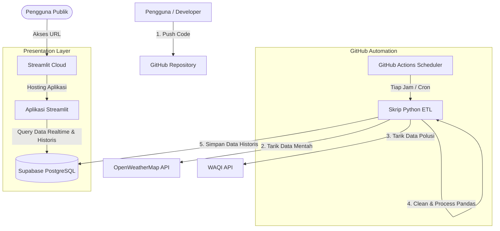

# 🌤️ Weather & Air Quality Realtime Portfolio Dashboard
### 🏗️ Supabase Zero Cost Stack (ETL Pipeline + PostgreSQL + Streamlit + GitHub Actions)

[](https://www.python.org/)
[](https://streamlit.io/)
[](https://supabase.com/)
[](https://github.com/features/actions)
[](https://pandas.pydata.org/)

Sebuah proyek **Portofolio Data End-to-End** berskala produksi untuk memantau cuaca dan kualitas udara secara realtime di berbagai kota besar di Indonesia. Sistem ini mengintegrasikan pengumpulan data (*Data Engineering ETL*), penyimpanan basis data relasional (*Data Storage*), otomatisasi tanpa server (*Serverless Automation*), hingga visualisasi interaktif tingkat tinggi (*Data Visualization*) secara **100% GRATIS (Zero Cost)**.

---

## 🗺️ Gambaran Arsitektur Sistem

Proyek ini dibangun menggunakan konsep **Decoupled Architecture** (memisahkan pengolahan data backend dengan visualisasi frontend) demi keandalan sistem:



---

## 🛠️ Pilihan Teknologi (Tech Stack)

1.  **Data Source (API)**:
    *   **OpenWeatherMap API**: Digunakan untuk mengambil kondisi cuaca (suhu, kelembaban, kecepatan angin, deskripsi cuaca, kode ikon) secara realtime.
    *   **WAQI (World Air Quality Index) API**: Menyuplai stasiun polusi udara terdekat berdasarkan koordinat GPS dari OpenWeatherMap, mengembalikan metrik AQI utama serta polutan detail ($PM_{2.5}, PM_{10}, O_3, NO_2, SO_2, CO$).
2.  **Data Engineering (ETL Pipeline)**:
    *   **Python (`requests`, `pandas`)**: Skrip backend (`src/etl/etl.py`) untuk penarikan data, pembersihan data mentah, konversi satuan, pengindeksan kategori AQI ke bahasa Indonesia, serta penanganan error stasiun secara otomatis.
3.  **Database Storage**:
    *   **Supabase (PostgreSQL)**: Menyimpan data historis terstruktur secara aman. Dilengkapi indeks performa (`idx_metrics_city_recorded_at`) dan aturan pencegahan duplikasi data melalui *Unique Constraints* pada kombinasi nama kota dan waktu pencatatan.
4.  **Automation Scheduler**:
    *   **GitHub Actions**: Cron Job serverless gratis yang memicu skrip ETL setiap jam secara otomatis tanpa perlu menyewa VPS.
5.  **Data Visualization (Frontend)**:
    *   **Streamlit & Plotly**: Dashboard interaktif premium dengan UI bertema gelap, *glassmorphism*, peta interaktif Mapbox yang menunjukkan sebaran kualitas udara nasional, tren grafik interaktif multiaxis, grafik korelasi cuaca vs polusi, serta panel panduan kesehatan cerdas.
    *   **Streamlit Community Cloud**: Tempat deployment frontend yang *Always-On* (tidak tidur/tanpa *cold start*) secara gratis.

---

## 📊 Skema Database (PostgreSQL)

Data disimpan dalam tabel `weather_air_metrics` dengan struktur kolom sebagai berikut:

| Nama Kolom | Tipe Data | Deskripsi |
| :--- | :--- | :--- |
| `id` | SERIAL (PK) | Auto-increment ID unik. |
| `city` | VARCHAR | Nama kota pantauan. |
| `country` | VARCHAR | Kode negara stasiun (default: `ID`). |
| `recorded_at` | TIMESTAMPTZ | Waktu pembacaan resmi data cuaca (UTC). |
| `temperature` | REAL | Temperatur udara saat ini (°C). |
| `humidity` | REAL | Kelembaban relatif udara (%). |
| `wind_speed` | REAL | Kecepatan angin aktual (km/jam). |
| `weather_description` | VARCHAR | Keterangan kondisi cuaca (e.g., "Hujan Sedang"). |
| `weather_icon` | VARCHAR | Kode ikon grafis cuaca dari OpenWeather. |
| `aqi` | INTEGER | Skor Air Quality Index (skala US EPA). |
| `aqi_category` | VARCHAR | Kategori kualitas udara (e.g., "Baik", "Sedang"). |
| `pm25` / `pm10` | REAL | Konsentrasi debu halus/kasar (µg/m³). |
| `no2` / `so2` / `o3` / `co` | REAL | Konsentrasi zat kimia gas di udara (µg/m³). |
| `created_at` | TIMESTAMPTZ | Timestamp baris data dimasukkan ke DB. |

---

## 🚀 Panduan Setup & Penggunaan Lokal

### 1. Kloning Repositori & Instalasi Dependensi
```bash
git clone https://github.com/USERNAME-ANDA/weather-air-portfolio.git
cd weather-air-portfolio
pip install -r requirements.txt
```

### 2. Konfigurasi Database Supabase
*   Masuk ke project Supabase Anda, lalu buka menu **SQL Editor**.
*   Salin isi file [schema.sql](src/database/schema.sql) ke editor SQL tersebut dan klik **Run** untuk membuat tabel database.

### 3. Konfigurasi Variabel Lingkungan
Buat file `.env` di root direktori proyek ini dan isi kredensial berikut:
```env
OPENWEATHER_API_KEY=kunci_api_openweather_anda
WAQI_API_TOKEN=token_api_waqi_anda
SUPABASE_URL=https://project-id-anda.supabase.co
SUPABASE_KEY=anon-public-key-supabse-anda
```

### 4. Menjalankan Skrip ETL (Data Pipeline)
Lakukan uji coba pipeline pengolahan data Anda secara lokal:
```bash
python src/etl/etl.py
```
*Skrip ini akan mengambil data, mengolahnya dengan Pandas, dan menyimpannya di database Supabase.*

### 5. Menjalankan Dashboard Streamlit
Nyalakan server visualisasi dashboard lokal Anda:
```bash
streamlit run src/app/app.py
```
*Aplikasi akan otomatis terbuka di browser Anda pada alamat `http://localhost:8501`.*

---

## 🌐 Cara Deploy ke Cloud (Gratis 100%)

### 1. Hubungkan ke GitHub
*   Buat repositori baru di akun GitHub Anda bernama `weather-air-portfolio`.
*   Push kode lokal Anda ke GitHub:
    ```bash
    git init
    git add .
    git commit -m "Initial commit: Supabase Zero Cost Stack"
    git branch -M main
    git remote add origin https://github.com/USERNAME/weather-air-portfolio.git
    git push -u origin main
    ```

### 2. Mengaktifkan Otomatisasi GitHub Actions (ETL Scheduler)
*   Buka tab **Settings** di repositori GitHub Anda.
*   Pilih menu **Secrets and variables** -> **Actions**.
*   Buat **New repository secret** untuk keempat kredensial berikut:
    *   `OPENWEATHER_API_KEY`
    *   `WAQI_API_TOKEN`
    *   `SUPABASE_URL`
    *   `SUPABASE_KEY`
*   *Selesai!* GitHub Actions sekarang akan otomatis berjalan setiap jam secara serverless untuk menarik data cuaca dan menyimpannya di Supabase. Anda juga bisa memicunya secara manual via tab **Actions** -> **Run Weather & AQI ETL Pipeline** -> Klik **Run workflow**.

### 3. Deploy Frontend ke Streamlit Community Cloud
*   Kunjungi [share.streamlit.io](https://share.streamlit.io/) dan buat akun menggunakan akun GitHub Anda.
*   Klik tombol **Create App**, pilih repositori `weather-air-portfolio`, pilih branch `main`, dan set path file utama ke `src/app/app.py`.
*   Sebelum mengklik Deploy, klik **Advanced Settings** dan masukkan kredensial database Supabase Anda pada kotak **Secrets** agar Streamlit bisa membaca database secara aman:
    ```toml
    SUPABASE_URL = "https://project-id-anda.supabase.co"
    SUPABASE_KEY = "anon-public-key-supabase-anda"
    ```
*   Klik **Deploy!** Website dashboard realtime Anda sekarang sudah aktif secara publik dan siap dipamerkan di CV atau portofolio Anda! 🚀
