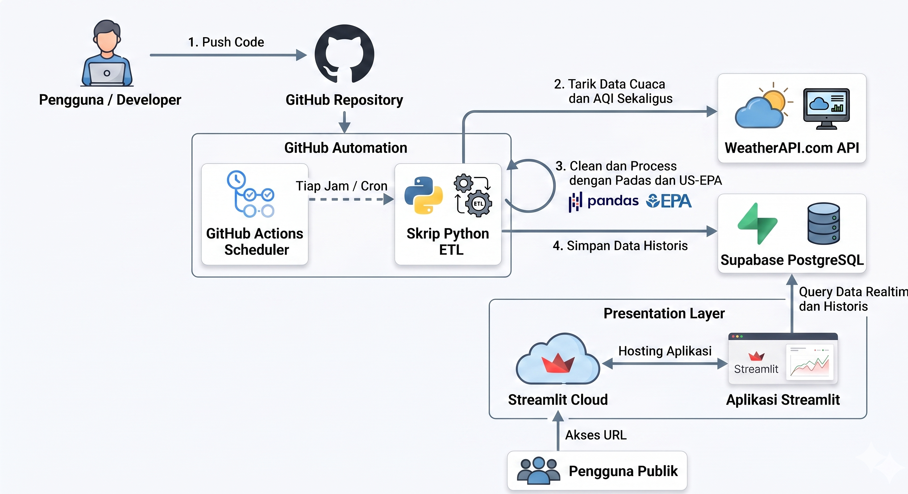

# 🌤️ Nusantara-Air-Sentinel: Real-Time Weather & Air Quality Data Pipeline
### 🏗️ Serverless Modern Data Stack (ETL Pipeline v2.0 + Supabase PostgreSQL + Streamlit + GitHub Actions)

[](https://www.python.org/)
[](https://streamlit.io/)
[](https://supabase.com/)
[](https://github.com/features/actions)
[](https://pandas.pydata.org/)

**Nusantara-Air-Sentinel** adalah platform data engineering end-to-end berskala produksi yang dirancang untuk mengumpulkan, memproses, dan memvisualisasikan data cuaca serta kualitas udara ($PM_{2.5}, PM_{10}, O_3, NO_2, SO_2, CO$) secara *real-time* di **52 kota strategis** yang tersebar di seluruh kepulauan Indonesia.

Sistem ini mengintegrasikan seluruh tahapan modern data stack (ETL, Data Storage, Serverless Orchestration, dan Presentation) dengan skema **100% GRATIS (Zero-Cost Stack)**.

---

## 🗺️ Gambaran Arsitektur Sistem

Proyek ini menggunakan **Decoupled Architecture** (memisahkan pemrosesan data backend dengan visualisasi frontend) untuk performa optimal dan reliabilitas yang tinggi:



---

## 🛠️ Pilihan Teknologi (Tech Stack)

1.  **Data Source (Unified API)**:
    *   **WeatherAPI.com**: Pustaka data tunggal terpadu yang menyajikan parameter cuaca fisik dan polusi kimia udara ($PM_{2.5}, PM_{10}, O_3, NO_2, SO_2, CO$) dalam satu pemanggilan API per kota.
2.  **Data Engineering (ETL Pipeline v2.0)**:
    *   **Python (`requests`, `pandas`, `concurrent.futures`)**: Skrip backend (`src/etl/etl.py`) dengan **parallel fetching** (10 worker threads) untuk penarikan data dari 52 kota secara simultan, dilengkapi **automatic retry** (3x dengan exponential backoff), **data validation**, dan **batch upsert** dalam 1 query.
    *   **US-EPA Standards Algorithm**: Implementasi fungsi matematika interpolasi breakpoints US-EPA secara lokal untuk menghitung skor Air Quality Index (AQI) murni berdasarkan konsentrasi debu halus ($PM_{2.5}$).
3.  **Database Storage**:
    *   **Supabase (PostgreSQL)**: Menggunakan Relational Database tangguh di cloud. Dilengkapi dengan *Row Level Security (RLS)* untuk keamanan akses, *Index Performance* (`idx_metrics_city_recorded_at`), dan aturan integritas data *Unique Constraints* (`unique_city_recorded_at`) guna mencegah data duplikat meskipun pipeline dipicu berulang kali.
4.  **Automation Scheduler**:
    *   **GitHub Actions**: Cron Job serverless terkelola yang memicu ETL secara otomatis setiap **3 jam** sekali (8 titik data/hari per kota) tanpa memerlukan server VPS berbayar.
5.  **Presentation & BI Dashboard**:
    *   **Streamlit & Plotly**: Visualisasi interaktif premium bertema gelap (*glassmorphism*), peta interaktif Mapbox sebaran nasional, diagram multi-axis waktu nyata, dan kartu peringatan rekomendasi aktivitas kesehatan yang dinamis.

---

## 📊 Skema Database (PostgreSQL)

Data disimpan dalam tabel `weather_air_metrics` dengan struktur kolom sebagai berikut:

| Nama Kolom | Tipe Data | Deskripsi |
| :--- | :--- | :--- |
| `id` | SERIAL (PK) | Auto-increment ID unik. |
| `city` | VARCHAR(100) | Nama kota pantauan (52 kota Nusantara). |
| `country` | VARCHAR(10) | Kode negara stasiun (default: `ID`). |
| `latitude` | DOUBLE PRECISION | Koordinat Lintang geografis. |
| `longitude` | DOUBLE PRECISION | Koordinat Bujur geografis. |
| `recorded_at` | TIMESTAMPTZ | Waktu resmi data diperbarui oleh stasiun (UTC). |
| `temperature` | REAL | Temperatur udara saat ini (°C). |
| `humidity` | REAL | Kelembaban relatif udara (%). |
| `wind_speed` | REAL | Kecepatan angin aktual (km/jam). |
| `weather_description` | VARCHAR(100) | Keterangan kondisi cuaca (e.g., "Hujan Sedang"). |
| `weather_icon` | VARCHAR(255) | URL ikon kondisi grafis cuaca dari WeatherAPI. |
| `aqi` | INTEGER | Skor Air Quality Index hasil kalkulasi US-EPA. |
| `aqi_category` | VARCHAR(50) | Kategori kualitas udara (e.g., "Baik", "Sedang"). |
| `pm25` / `pm10` | REAL | Konsentrasi debu halus/kasar (µg/m³). |
| `no2` / `so2` / `o3` / `co` | REAL | Konsentrasi zat polutan kimia (µg/m³). |
| `created_at` | TIMESTAMPTZ | Timestamp data dimasukkan ke database. |

---

## 🚀 Panduan Setup & Penggunaan Lokal

### 1. Kloning Repositori & Instalasi Dependensi
```bash
git clone https://github.com/USERNAME-ANDA/weather-air-portfolio.git
cd weather-air-portfolio
pip install -r requirements.txt
```

### 2. Konfigurasi Database Supabase
*   Masuk ke project Supabase Anda, lalu buka menu **SQL Editor**.
*   Salin isi file [schema.sql](src/database/schema.sql) ke editor SQL tersebut dan klik **Run** untuk membuat tabel database.

### 3. Konfigurasi Variabel Lingkungan
Buat file `.env` di root direktori proyek ini dan isi kredensial berikut:
```env
WEATHERAPI_KEY=kunci_api_weatherapi_anda
SUPABASE_URL=https://project-id-anda.supabase.co
SUPABASE_KEY=anon-public-key-supabase-anda
SUPABASE_SERVICE_KEY=service-role-key-supabase-anda
```
> **Catatan**: `SUPABASE_KEY` (anon key) digunakan oleh Dashboard untuk read-only. `SUPABASE_SERVICE_KEY` (service role key) digunakan oleh ETL Pipeline untuk write access yang mem-bypass Row Level Security. Dapatkan keduanya di Supabase Dashboard → Settings → API.

### 4. Menjalankan Skrip ETL (Data Pipeline)
Lakukan uji coba pipeline pengolahan data Anda secara lokal:
```bash
python src/etl/etl.py
```

### 5. Menjalankan Dashboard Streamlit
Nyalakan server visualisasi dashboard lokal Anda:
```bash
streamlit run src/app/app.py
```

---

## 🌐 Cara Deploy ke Cloud (Gratis 100%)

### 1. Hubungkan ke GitHub
*   Buat repositori baru di akun GitHub Anda bernama `weather-air-portfolio`.
*   Push kode lokal Anda ke GitHub:
    ```bash
    git init
    git add .
    git commit -m "Initial commit: Nusantara Air Sentinel"
    git branch -M main
    git remote add origin https://github.com/USERNAME/weather-air-portfolio.git
    git push -u origin main
    ```

### 2. Mengaktifkan Otomatisasi GitHub Actions (ETL Scheduler)
*   Buka tab **Settings** di repositori GitHub Anda.
*   Pilih menu **Secrets and variables** -> **Actions**.
*   Buat **New repository secret** untuk ketiga kredensial berikut:
    *   `WEATHERAPI_KEY`
    *   `SUPABASE_URL`
    *   `SUPABASE_SERVICE_KEY` ← Gunakan **service role key** (bukan anon key)
*   *Selesai!* GitHub Actions sekarang akan otomatis berjalan **setiap 3 jam** secara serverless untuk menarik data cuaca dan menyimpannya di Supabase.

### 3. Deploy Frontend ke Streamlit Community Cloud
*   Kunjungi [share.streamlit.io](https://share.streamlit.io/) dan login menggunakan akun GitHub Anda.
*   Klik tombol **Create App**, pilih repositori `weather-air-portfolio`, pilih branch `main`, dan set path file utama ke `src/app/app.py`.
*   Sebelum mengklik Deploy, klik **Advanced Settings** dan masukkan kredensial database Supabase Anda pada kotak **Secrets** agar Streamlit bisa membaca database secara aman:
    ```toml
    SUPABASE_URL = "https://project-id-anda.supabase.co"
    SUPABASE_KEY = "anon-public-key-supabase-anda"
    ```
*   Klik **Deploy!** Website dashboard realtime Anda sekarang sudah aktif secara publik dan siap dicantumkan di CV Anda! 🚀
